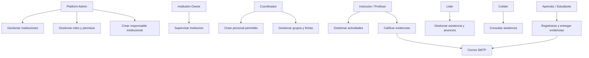
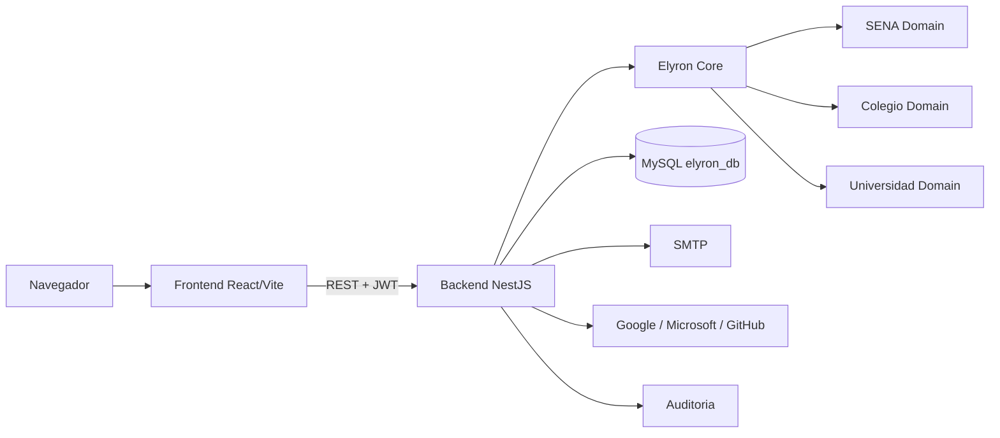
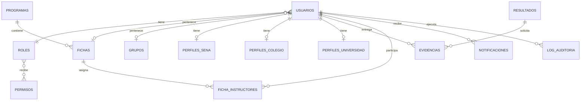

# Elyron Platform
## Documento técnico del proyecto formativo

**Version:** 1.0  
**Fecha de elaboracion:** 09 de septiembre de 2026  
**Estado:** Documento base para revision y conversion a PDF

## Datos institucionales por completar

| Campo | Informacion |
|---|---|
| Nombre del proyecto | Elyron Platform |
| Integrantes | `[COMPLETAR]` |
| Programa de formacion | `[COMPLETAR]` |
| Numero de ficha | `[COMPLETAR]` |
| Instructor | `[COMPLETAR]` |
| Centro de formacion | `[COMPLETAR]` |
| Fecha oficial de entrega | `[COMPLETAR]` |
| Repositorio GitHub | `[COMPLETAR]` |
| URL de produccion | `[COMPLETAR SI APLICA]` |

---

# 1. Portada

**Proyecto:** Elyron Platform  
**Tipo de solucion:** Plataforma web de gestion academica institucional  
**Dominios:** SENA, colegio y universidad  
**Integrantes:** `[COMPLETAR]`  
**Programa, ficha, instructor y centro:** `[COMPLETAR]`

La portada final debe incluir el logo de Elyron, los datos institucionales del equipo y la fecha de entrega.

# 2. Introduccion

Elyron Platform es una plataforma web de gestion academica que centraliza procesos de registro, autenticacion, seguimiento, evidencias, comunicacion, asistencia y administracion de usuarios. La solucion contempla tres ecosistemas academicos: formacion SENA, educacion escolar y educacion universitaria.

Cada ecosistema utiliza conceptos propios. En el SENA se manejan fichas, programas, competencias, resultados de aprendizaje, evidencias y etapas de formacion. En el colegio se manejan grupos, grados, jornadas, actividades y asistencia. En la universidad se manejan programas academicos, semestres, creditos, estados academicos y proyeccion de graduacion.

El sistema busca que la informacion declarada por el usuario sea validada por el backend. Por ejemplo, el numero de ficha SENA y el codigo de curso escolar deben existir y estar activos antes de crear el perfil academico. Esto reduce registros falsos, duplicados e inconsistencias.

Los beneficiarios son aprendices, estudiantes, instructores, profesores, coordinadores, responsables institucionales y administradores de la plataforma. La solucion tambien prepara la integracion de correo SMTP y autenticacion social con Google, Microsoft y GitHub.

# 3. Planteamiento del problema

## 3.1 Problema central

Los procesos academicos suelen estar distribuidos en hojas de calculo, formularios, chats y plataformas separadas. Esta fragmentacion dificulta comprobar si una persona pertenece realmente a una ficha, grupo o programa, y hace que el seguimiento dependa de informacion manual.

Adicionalmente, un sistema basado unicamente en el nombre de un rol puede otorgar capacidades excesivas. Ser coordinador no deberia significar administrar todas las instituciones ni crear cualquier tipo de cuenta.

## 3.2 Situacion actual

- Formularios que permiten escribir libremente instituciones, programas o cursos.
- Falta de validacion centralizada de fichas y grupos.
- Informacion academica incompleta o duplicada.
- Comunicaciones distribuidas en diferentes canales.
- Dificultad para saber quien puede gestionar una evidencia o una asistencia.
- Accesos administrativos que pueden confundirse con el login publico.

## 3.3 Consecuencias

- Creacion de cuentas sin pertenencia academica comprobada.
- Datos erroneos o incompletos en los perfiles.
- Exposicion de informacion de otras instituciones.
- Creacion no controlada de cuentas de personal.
- Falta de trazabilidad sobre las operaciones administrativas.

## 3.4 Poblacion afectada

Aprendices SENA, estudiantes de colegio, estudiantes universitarios, instructores, docentes, coordinadores, responsables institucionales y administradores.

# 4. Justificacion

Elyron es importante porque transforma el registro de usuarios en un proceso de validacion y construccion de trayectoria academica. El estudiante no solo crea una cuenta: selecciona su perfil, declara su identificacion, registra una ficha o grupo y recibe una trayectoria calculada con datos institucionales.

La plataforma mejora la seguridad mediante JWT, bcrypt, verificacion de correo, rate limiting, validacion en backend, cifrado AES-256-GCM, hash de documentos, permisos atomicos y auditoria. Tambien separa el login publico del acceso institucional para reducir la superficie de ataque.

La solucion permite que un administrador cree o autorice responsables institucionales, que un coordinador cree solamente los roles permitidos y que instructores, docentes, lideres y colideres trabajen dentro de su alcance academico.

# 5. Objetivos

## 5.1 Objetivo general

Construir una plataforma web academica institucional que permita registrar, validar, administrar y acompañar a estudiantes de SENA, colegio y universidad mediante autenticacion segura, control de acceso, gestion de trayectoria y comunicacion institucional.

## 5.2 Objetivos especificos

1. Diseñar un registro diferenciado para aprendiz SENA, estudiante de colegio y estudiante universitario.
2. Validar fichas SENA y codigos de curso escolar contra la base de datos.
3. Calcular fechas estimadas de finalizacion usando informacion institucional.
4. Implementar autenticacion JWT, bcrypt, verificacion de correo y rate limiting.
5. Controlar el acceso mediante rol, institucion, permisos y atributos de liderazgo.
6. Permitir que administradores y coordinadores creen cuentas de personal segun sus reglas.
7. Gestionar evidencias y enviar correos cuando sean aprobadas o devueltas.
8. Registrar operaciones sensibles en auditoria.
9. Proporcionar paneles diferenciados por rol e institucion.
10. Preparar autenticacion social con Google, Microsoft y GitHub.

# 6. Alcance

## 6.1 Funcionalidades incluidas

| Codigo | Funcionalidad |
|---|---|
| ALC01 | Registro de aprendiz SENA con ficha activa validada. |
| ALC02 | Registro de estudiante de colegio con grupo activo validado. |
| ALC03 | Registro de estudiante universitario. |
| ALC04 | Catalogo de universidades, colegios, regionales, centros y programas. |
| ALC05 | Motor de trayectoria SENA, colegio y universidad. |
| ALC06 | Cifrado y hash de documentos. |
| ALC07 | Login publico para estudiantes y aprendices. |
| ALC08 | Login institucional separado para cargos. |
| ALC09 | Creacion restringida de cuentas de personal. |
| ALC10 | Roles, permisos atomicos e institucion. |
| ALC11 | Lider y colider con acceso diferenciado. |
| ALC12 | Evidencias y retroalimentacion. |
| ALC13 | Asistencia editable para lider y solo lectura para colider. |
| ALC14 | Calendario con avisos de entregas proximas. |
| ALC15 | Verificacion y notificacion por correo SMTP. |
| ALC16 | OAuth configurable con Google, Microsoft y GitHub. |
| ALC17 | Auditoria de acciones academicas y administrativas. |

## 6.2 Funcionalidades excluidas o futuras

- Sincronizacion automatica con Sofia Plus o sistemas externos sin convenio y credenciales.
- Certificacion oficial de graduacion o finalizacion.
- Firma digital de certificados.
- Aplicacion movil nativa.
- Gestion de nomina, facturacion o cartera.
- Despliegue productivo publico, si aun no existe URL institucional.
- Activacion real de OAuth y SMTP hasta configurar credenciales.

# 7. Requerimientos

## 7.1 Requerimientos funcionales

| Codigo | Requerimiento | Prioridad |
|---|---|---|
| RF01 | Seleccionar el tipo de perfil academico. | Alta |
| RF02 | Registrar correo, contraseña, nombres, apellidos y documento. | Alta |
| RF03 | Rechazar correos duplicados. | Alta |
| RF04 | Validar una ficha SENA activa. | Alta |
| RF05 | Validar un codigo de curso escolar activo. | Alta |
| RF06 | Rechazar fichas o grupos inexistentes. | Alta |
| RF07 | Obtener programa, fecha y duracion desde la entidad academica. | Alta |
| RF08 | Calcular finalizacion estimada SENA. | Alta |
| RF09 | Calcular semestres restantes universitarios. | Alta |
| RF10 | Calcular finalizacion escolar en noviembre. | Media |
| RF11 | Crear y consultar evidencias. | Alta |
| RF12 | Aprobar o devolver evidencias con feedback. | Alta |
| RF13 | Enviar correo al aprendiz cuando se califica una evidencia. | Alta |
| RF14 | Registrar asistencia. | Alta |
| RF15 | Mostrar liderazgo de la ficha. | Alta |
| RF16 | Permitir que el colider consulte asistencia sin editar. | Alta |
| RF17 | Crear cuentas de personal desde panel autorizado. | Alta |
| RF18 | Aplicar reglas de roles permitidos por institucion. | Alta |
| RF19 | Impedir que un aprendiz regular acceda al panel de liderazgo. | Alta |
| RF20 | Permitir un solo lider y un solo colider por ficha. | Alta |
| RF21 | Separar login publico y login institucional. | Alta |
| RF22 | Ofrecer OAuth configurable. | Media |
| RF23 | Registrar auditoria. | Alta |

## 7.2 Requerimientos no funcionales

| Codigo | Requerimiento | Criterio |
|---|---|---|
| RNF01 | Seguridad | JWT, bcrypt, rate limiting y validacion backend. |
| RNF02 | Autorizacion | Denegar por defecto si no existe permiso. |
| RNF03 | Proteccion de datos | AES-256-GCM y hash SHA-256 para documentos. |
| RNF04 | Rendimiento | Respuestas comunes menores a 3 segundos en entorno local. |
| RNF05 | Mantenibilidad | Modulos separados por dominio. |
| RNF06 | Usabilidad | Errores claros y validacion inmediata en formularios. |
| RNF07 | Responsive | Funcionamiento en escritorio y movil. |
| RNF08 | Auditoria | Registrar actor, accion, recurso, fecha y resultado. |
| RNF09 | Configurabilidad | Variables de entorno para DB, JWT, SMTP y OAuth. |
| RNF10 | Interoperabilidad | API REST JSON. |

# 8. Casos de uso

## 8.1 Actores

- Platform Admin.
- Institution Owner o responsable institucional.
- Coordinador academico.
- Instructor o profesor.
- Lider.
- Colider.
- Aprendiz o estudiante.
- Proveedor OAuth.
- Servidor SMTP.

## 8.2 Diagrama general

## 8.3 Casos de uso principales

### CU01 — Registrar aprendiz SENA

| Campo | Descripcion |
|---|---|
| Actor | Aprendiz |
| Precondicion | Existe una ficha activa. |
| Flujo | Seleccionar SENA → ingresar identificacion → ingresar ficha → validar ficha → cargar programa y fechas → seleccionar regional, centro y ciudad → crear cuenta. |
| Resultado | Perfil asociado a una ficha existente. |
| Excepciones | Ficha inexistente, documento duplicado, correo duplicado o datos incompletos. |

### CU02 — Crear cuenta de personal

| Campo | Descripcion |
|---|---|
| Actor | Admin o coordinador autorizado |
| Precondicion | Tiene permiso `users.create`. |
| Flujo | Abrir panel → elegir rol permitido → ingresar datos → validar alcance → crear cuenta. |
| Resultado | Cuenta disponible en login institucional. |

### CU03 — Calificar evidencia

| Campo | Descripcion |
|---|---|
| Actor | Instructor o profesor |
| Flujo | Abrir evidencia pendiente → aprobar/devolver → escribir feedback → guardar → notificar al estudiante. |
| Resultado | Evidencia actualizada y notificacion enviada. |

### CU04 — Gestionar asistencia

| Campo | Descripcion |
|---|---|
| Actor | Lider o instructor |
| Flujo | Abrir ficha/grupo → seleccionar fecha → marcar asistencia, permiso o ausencia. |
| Resultado | Registro guardado para la ficha. |

### CU05 — Consultar asistencia como colider

| Campo | Descripcion |
|---|---|
| Actor | Colider |
| Precondicion | `esVoceroSuplente=true`. |
| Resultado | Vista de asistencia en solo lectura. |

# 9. Historias de usuario

| ID | Historia | Prioridad |
|---|---|---|
| HU01 | Como aprendiz SENA, quiero registrar mi ficha para demostrar mi pertenencia. | Alta |
| HU02 | Como estudiante de colegio, quiero validar mi codigo de curso. | Alta |
| HU03 | Como universitario, quiero seleccionar mi universidad. | Alta |
| HU04 | Como aprendiz, quiero ver mi programa y finalizacion estimada. | Alta |
| HU05 | Como instructor, quiero ver mis grupos asignados. | Alta |
| HU06 | Como instructor, quiero calificar evidencias con feedback. | Alta |
| HU07 | Como aprendiz, quiero recibir correo cuando mi evidencia sea calificada. | Alta |
| HU08 | Como coordinador, quiero crear instructores de mi institucion. | Alta |
| HU09 | Como coordinador, quiero que se restrinjan los roles que puedo crear. | Alta |
| HU10 | Como lider, quiero gestionar asistencia de mi ficha. | Alta |
| HU11 | Como colider, quiero consultar asistencia sin modificarla. | Alta |
| HU12 | Como aprendiz regular, quiero que no aparezcan funciones de liderazgo. | Alta |
| HU13 | Como admin, quiero suspender cuentas y gestionar permisos. | Alta |
| HU14 | Como usuario, quiero verificar mi correo. | Alta |
| HU15 | Como personal, quiero entrar por una puerta institucional separada. | Alta |

# 10. Arquitectura del sistema

## 10.1 Tecnologias

- Frontend: React 19, Vite, TypeScript, React Router, Axios, Framer Motion, Tailwind CSS.
- Backend: NestJS 11, TypeScript, TypeORM, Passport/JWT, bcrypt, class-validator.
- Base de datos: MySQL 8.
- Correo: Nodemailer y SMTP.
- OAuth: Authorization Code para Google, Microsoft y GitHub.
- Infraestructura auxiliar: Docker Compose e ioredis preparado para uso futuro.

## 10.2 Diagrama

## 10.3 Separacion por dominio

| Dominio | Conceptos principales |
|---|---|
| SENA | Ficha, programa, competencia, resultado, evidencia, etapa productiva, instructor, lider, colider. |
| Colegio | Matricula, grupo, grado, asignatura, actividad, profesor, asistencia. |
| Universidad | Matricula, programa, semestre, creditos, asignaturas, profesor, proyecto de grado. |
| Core | Identidad, autenticacion, autorizacion, correo, auditoria, archivos y notificaciones. |

# 11. Modelo entidad relacion

Las cardinalidades principales son: un usuario tiene un rol; un rol tiene muchos permisos; una ficha tiene muchos aprendices; un programa puede tener muchas fichas; un usuario puede tener un perfil de su dominio; una evidencia pertenece a un resultado y a un estudiante.

# 12. Diccionario de datos

## 12.1 Tablas principales

| Tabla | Campos principales | Descripcion |
|---|---|---|
| `usuarios` | id, email, password, firstName, lastName, roleId, institucion, fichaId, grupoId, esVocero, esVoceroSuplente | Identidad, rol, institución y alcance base del usuario. |
| `roles` | id, name, description | Roles disponibles en Elyron. |
| `permisos` | id, name, module, action | Permisos atomicos por modulo y operacion. |
| `roles_permisos` | roleId, permissionId | Relacion de permisos otorgados a roles. |
| `fichas` | id, code, name, startDate, endDate, status, programaId | Fichas de formacion SENA. |
| `grupos` | id, code, nombre, grado, jornada, anioLectivo, colegio | Cursos/grupos escolares. |
| `programas` | id, name, institutionId, duracionMeses | Programas academicos y duracion oficial. |
| `perfiles_sena` | usuarioId, numeroFicha, programaFormacion, centroFormacion, regional, ciudad, etapa, estadoAcademico | Perfil del aprendiz y trayectoria SENA. |
| `perfiles_colegio` | usuarioId, colegio, grado, jornada, anioAcademico, ciudad, estadoAcademico | Perfil de estudiante escolar. |
| `perfiles_universidad` | usuarioId, universidad, programaAcademico, semestre, totalSemestres, creditos, estadoAcademico | Perfil y progreso universitario. |
| `evidencias` | id, resultadoId, submittedById, status, feedback, reviewedAt | Entregas y calificaciones de evidencias. |
| `notificaciones` | userId, title, message, isRead | Notificaciones internas. |
| `log_auditoria` | actor, action, target, category, time | Auditoría de operaciones. |

## 12.2 Restricciones importantes

- `usuarios.email` es unico.
- `roles.name` y `permisos.name` son unicos.
- `usuarios.roleId`, `fichaId` y `grupoId` son relaciones con otras entidades.
- `perfiles_sena.numeroFicha` **no** es unico porque una ficha tiene muchos aprendices.
- `documentoHash` es unico por perfil para evitar duplicados entre dominios.
- El numero de documento se cifra; no se usa texto plano como mecanismo de deduplicacion.

# 13. Mockups o prototipos

| Pantalla | Ruta | Evidencia que se debe capturar |
|---|---|---|
| Login publico | `/login` | SENA, colegio, universidad y login social. |
| Acceso institucional | `/acceso-institucional` | Admin, coordinador, instructor y docentes. |
| Registro | `/register` | Wizard, ficha validada y resultado. |
| Campus | `/campus` o `/dashboard` | Inicio del estudiante/aprendiz. |
| Mi ficha | `/ficha` | Líder, colíder, instructores y aprendices. |
| Panel líder | `/vocera` | Asistencia, anuncios e inquietudes. |
| Panel colíder | `/colider` | Asistencia en solo lectura. |
| Calendario | `/calendario` | Avisos de entregas próximas. |
| Admin | `/admin` | Usuarios, roles, instituciones y auditoría. |
| Coordinador | `/coordinador` | Grupos y creación de personal permitido. |

# 14. Tecnologias utilizadas

| Tecnologia | Proposito |
|---|---|
| React 19 | Interfaz web. |
| Vite | Desarrollo y build frontend. |
| TypeScript | Tipado. |
| React Router | Rutas y guards. |
| Axios | Peticiones HTTP. |
| Framer Motion | Animaciones. |
| Tailwind CSS | Estilos y responsive. |
| NestJS | Backend modular. |
| TypeORM | Persistencia ORM. |
| MySQL | Base de datos. |
| JWT | Autenticacion y sesiones. |
| Passport | Estrategias local/JWT. |
| bcrypt | Hash de contraseñas. |
| Nodemailer | Envio SMTP. |
| class-validator | Validacion de DTOs. |
| Multer | Subida de archivos. |
| Docker Compose | Infraestructura local. |
| Git/GitHub | Control de versiones. |

# 15. Evidencias de desarrollo

| ID | Evidencia | Captura requerida |
|---|---|---|
| ED01 | Arbol de carpetas frontend y backend. | Captura del explorador. |
| ED02 | Modulos NestJS por dominio. | Captura de `backend/src/modules`. |
| ED03 | Registro academico por perfil. | Captura de `/register`. |
| ED04 | Catalogo y ficha validada. | Captura del formulario y respuesta. |
| ED05 | Base de datos MySQL. | Captura de tablas y relaciones. |
| ED06 | Roles y permisos. | Captura de `roles`, `permisos`, `roles_permisos`. |
| ED07 | Login publico y puerta institucional. | Dos capturas separadas. |
| ED08 | Panel de administrador. | Captura de `/admin`. |
| ED09 | Panel de coordinador. | Captura de `/coordinador`. |
| ED10 | Crear cuenta de instructor/docente. | Captura del modal. |
| ED11 | Lider y colider. | Capturas de ambos perfiles. |
| ED12 | Calendario con actividad pendiente. | Captura del aviso. |
| ED13 | Correo de verificacion. | Captura SMTP o consola preview. |
| ED14 | Correo de evidencia calificada. | Captura del correo. |
| ED15 | Historial de commits. | Captura de GitHub. |

Las capturas de GitHub, reuniones y desarrollo deben ser las reales del equipo; no deben inventarse.

# 16. Plan de pruebas

| ID | Entrada | Resultado esperado |
|---|---|---|
| CP01 | Ficha SENA `2957489` | Validacion correcta y programa cargado. |
| CP02 | Ficha SENA inexistente | HTTP 400, no se crea perfil. |
| CP03 | Registro sin ficha | Boton bloqueado y backend rechaza. |
| CP04 | Curso `10-02` | Grupo escolar valido. |
| CP05 | Curso inexistente | HTTP 400. |
| CP06 | Documento duplicado | HTTP 409. |
| CP07 | Aprendiz por login publico | HTTP 201. |
| CP08 | Instructor por login publico | HTTP 403. |
| CP09 | Instructor por puerta institucional | HTTP 201. |
| CP10 | Admin por puerta institucional | HTTP 201 y rol `admin`. |
| CP11 | Coordinador crea instructor | HTTP 201. |
| CP12 | Coordinador crea coordinador | HTTP 403. |
| CP13 | Instructor crea cuenta | HTTP 403 por `users.create`. |
| CP14 | Aprendiz regular abre `/vocera` | 403. |
| CP15 | Lider abre `/vocera` | Acceso permitido. |
| CP16 | Colider edita asistencia | Edicion bloqueada. |
| CP17 | Lider edita asistencia | Edicion permitida. |
| CP18 | Registro de correo | Enlace generado. |
| CP19 | Evidencia aprobada | Notificacion y correo. |
| CP20 | OAuth sin credenciales | Error controlado, sin ruptura. |

# 17. Evidencias de pruebas

## 17.1 Resultados verificados

| Prueba | Resultado |
|---|---|
| Backend build | OK |
| Backend lint | OK |
| Frontend typecheck | OK |
| Frontend lint | OK |
| Frontend build | OK |
| Backend health | HTTP 200 |
| Frontend dev server | HTTP 200 |
| Ficha `2957489` | Activa y valida |
| Curso `10-02` | Activo y valido |
| Registro SENA valido | HTTP 201 |
| Registro SENA invalido | HTTP 400 |
| Login publico instructor | HTTP 403 |
| Login institucional instructor | HTTP 201 |
| Coordinador crea instructor | HTTP 201 |
| Coordinador crea coordinador | HTTP 403 |
| Instructor crea cuenta | HTTP 403 |
| Lider, colider y aprendiz separados | Verificado en JWT |

## 17.2 Pendiente de capturar para el PDF

- Pruebas unitarias formales con Jest.
- Pruebas e2e con Supertest.
- Correo SMTP real.
- Login OAuth con credenciales reales.
- Capturas del navegador.
- Pruebas de carga.

# 18. Despliegue

## 18.1 Entorno local

| Componente | Valor |
|---|---|
| Frontend | `http://localhost:5173` |
| Backend | `http://localhost:3000/api` |
| Base de datos | MySQL `localhost:3306` / `elyron_db` |
| Backend desarrollo | `npm run start:dev` |
| Frontend desarrollo | `npm run dev` |
| Modo frontend actual | `VITE_USE_MOCK_AUTH=false` |

## 18.2 Variables de entorno

`DB_HOST`, `DB_PORT`, `DB_USERNAME`, `DB_PASSWORD`, `DB_NAME`, `JWT_SECRET`, `JWT_REFRESH_SECRET`, `FRONTEND_URL`, `PUBLIC_API_URL`, `MAIL_ENABLED`, `SMTP_HOST`, `SMTP_PORT`, `SMTP_USER`, `SMTP_PASS`, `SMTP_FROM`, `GOOGLE_CLIENT_ID`, `GOOGLE_CLIENT_SECRET`, `GITHUB_CLIENT_ID`, `GITHUB_CLIENT_SECRET`, `MICROSOFT_CLIENT_ID`, `MICROSOFT_CLIENT_SECRET` y `MICROSOFT_TENANT`.

## 18.3 Proceso

1. Configurar variables de entorno.
2. Crear MySQL y la base `elyron_db`.
3. Ejecutar seed solo en desarrollo.
4. Ejecutar `npm run build` en backend y frontend.
5. Publicar backend con HTTPS.
6. Publicar frontend usando la URL del backend.
7. Configurar callbacks OAuth y SMTP.
8. Ejecutar pruebas de health, login, registro, correo y auditoria.

En produccion se debe desactivar `synchronize`, usar migraciones, rotar secretos, usar backups y no publicar contraseñas de demo.

# 19. Conclusiones

1. Elyron implementa el ciclo de construccion de software desde el registro y analisis hasta la validacion, persistencia, autorizacion y pruebas funcionales.
2. La validacion de fichas y grupos evita crear perfiles academicos sin una referencia institucional activa.
3. La separacion de roles, permisos, institucion y atributos de liderazgo limita las funciones de aprendices, colideres, lideres, instructores, coordinadores y administradores.
4. La plataforma comparte infraestructura de seguridad, identidad, auditoria y notificaciones, pero conserva reglas separadas para SENA, colegio y universidad.
5. El proyecto queda preparado para correo SMTP, OAuth y despliegue productivo, pendientes de credenciales y configuracion institucional real.

# 20. Bibliografia

- NestJS. (s. f.). *Documentation*. https://docs.nestjs.com/
- React. (s. f.). *React documentation*. https://react.dev/
- Vite. (s. f.). *Vite documentation*. https://vite.dev/guide/
- TypeORM. (s. f.). *TypeORM documentation*. https://typeorm.io/
- MySQL. (s. f.). *MySQL 8.0 Reference Manual*. https://dev.mysql.com/doc/refman/8.0/en/
- JSON Web Tokens. (s. f.). *Introduction to JSON Web Tokens*. https://jwt.io/introduction
- OWASP Foundation. (s. f.). *Authorization Cheat Sheet*. https://cheatsheetseries.owasp.org/cheatsheets/Authorization_Cheat_Sheet.html
- OWASP Foundation. (s. f.). *Password Storage Cheat Sheet*. https://cheatsheetseries.owasp.org/cheatsheets/Password_Storage_Cheat_Sheet.html
- OAuth. (s. f.). *OAuth 2.0*. https://oauth.net/2/
- Nodemailer. (s. f.). *Nodemailer documentation*. https://nodemailer.com/
- GitHub. (s. f.). *OAuth Apps documentation*. https://docs.github.com/en/apps/oauth-apps
- Google. (s. f.). *OAuth 2.0 for Web Server Applications*. https://developers.google.com/identity/protocols/oauth2
- Microsoft. (s. f.). *Microsoft identity platform documentation*. https://learn.microsoft.com/en-us/entra/identity-platform/
- Servicio Nacional de Aprendizaje. (s. f.). *Portal oficial del SENA*. https://www.sena.edu.co/

# Entrega final

El equipo debe entregar:

1. Documento completo en PDF.
2. Repositorio GitHub.
3. Codigo fuente.
4. Base de datos o script de respaldo.
5. Presentacion de sustentacion.
6. Demostracion funcional.

## Lista de revision

- [ ] Completar integrantes, programa, ficha, instructor y centro.
- [ ] Agregar logo y portada formal.
- [ ] Agregar indice y numeracion de paginas.
- [ ] Exportar diagramas ER, casos de uso y arquitectura.
- [ ] Insertar capturas reales del sistema.
- [ ] Insertar enlace real de GitHub.
- [ ] Insertar matriz de pruebas con capturas.
- [ ] Insertar evidencias de reuniones y commits.
- [ ] Revisar bibliografia en APA 7.
- [ ] Verificar que el PDF final abra correctamente.
