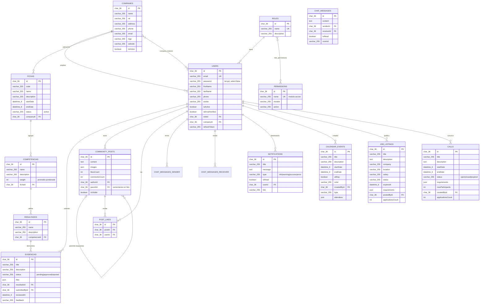

# Modelo de datos - Elyron (MySQL 8)

El modelado está definido por las entidades TypeORM en `src/modules/**/entities` y `src/common/base.entity.ts`. En desarrollo (`NODE_ENV != production`) TypeORM crea y actualiza las tablas automáticamente con `synchronize: true`; no hace falta escribir DDL a mano.

Todas las tablas heredan de `BaseEntity`:

| Columna | Tipo MySQL | Descripción |
|---|---|---|
| `id` | `char(36)` PK | UUID generado por la aplicación |
| `createdAt` | `datetime(6)` | Fecha de creación |
| `updatedAt` | `datetime(6)` | Última actualización |

Charset de conexión: `utf8mb4` (soporta emojis y acentos), zona horaria UTC (`timezone: 'Z'`).

## Diagrama entidad-relación



## Jerarquía académica (núcleo del SENA)

```
COMPANIES ──< FICHAS ──< COMPETENCIAS ──< RESULTADOS ──< EVIDENCIAS >── USERS
```

Cada nivel es un `ManyToOne` con columna FK explícita (`fichaId`, `competenciaId`, `resultadoId`), lo que permite los filtros por query param que ya expone la API.

## Tablas de unión generadas automáticamente

| Tabla | Origen | Columnas |
|---|---|---|
| `role_permissions` | `@ManyToMany` Role↔Permission | `roleId`, `permissionId` |
| `company_trainers` | `@ManyToMany` Company↔User | `companyId`, `trainerId` |

## Restricciones clave

- `users.email` y `roles.name`: únicos.
- `permissions.name`: único (formato `modulo.accion`, ej. `evidencias.approve`).
- `post_likes`: constraint único `(postId, userId)` — garantiza un like por usuario.
- FKs como `char(36)` sin constraint físico duro en algunos casos: las relaciones se validan en servicio (ej. evidencia valida que el resultado exista antes de guardar).
- Estados como `varchar` con default: `fichas.status='active'`, `evidencias.status='pending'`, `calls.status='open'`, `job_listings.status='active'`. La transición de evidencias se valida en `EvidenciasService.update`.

## Puesta en marcha contra tu MySQL local

Ejecuta una sola vez como root (Workbench o `mysql -u root -p`):

```sql
CREATE DATABASE IF NOT EXISTS elyron_db CHARACTER SET utf8mb4 COLLATE utf8mb4_unicode_ci;
CREATE USER IF NOT EXISTS 'elyron'@'localhost' IDENTIFIED BY 'elyron123';
CREATE USER IF NOT EXISTS 'elyron'@'%' IDENTIFIED BY 'elyron123';
GRANT ALL PRIVILEGES ON elyron_db.* TO 'elyron'@'localhost';
GRANT ALL PRIVILEGES ON elyron_db.* TO 'elyron'@'%';
FLUSH PRIVILEGES;
```

Después:

```bash
npm run seed     # roles SENA + permisos modulo.accion + admin
npm run start:dev
```

Las tablas se crean solas al arrancar. Para ver el diagrama renderizado pega el bloque mermaid de arriba en https://mermaid.live o en un README de GitHub/Notion.
